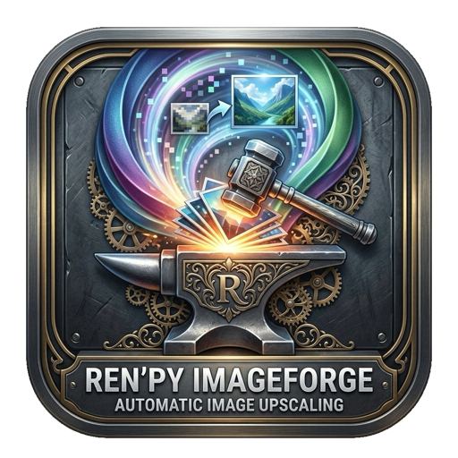

# RenPy ImageForge

<p align="center">
  
</p>

Tool macOS per **crop batch** di immagini con aspect ratio fisso, resize,
**upscaling AI** (Real-ESRGAN ncnn/Metal) su Apple Silicon e **integrazione
giochi Ren'Py** (estrazione archivi, scansione immagini, sostituzione in-place).

Pensato per il caso d'uso: hai un mucchio di immagini (es. webp 1620x1080),
le croppi in un aspect ratio specifico (es. 16:9) e poi le upscalai a full HD
(1920x1080) con un modello AI.

> Documentazione inglese: [README.md](README.md) · [Changelog](UPDATE.md)

## Requisiti

- macOS su Apple Silicon (testato su M2) o Intel
- Python 3.10+
- [uv](https://docs.astral.sh/uv/) (gestore pacchetti, installa automaticamente le dipendenze)
- Real-ESRGAN ncnn bundled in `vendor/` (già incluso)

## Avvio

```bash
cd /Volumes/NVME/dev-ai/RenPy-ImageForge
./start.sh
```

`uv` crea automaticamente il venv e installa le dipendenze da `pyproject.toml`
al primo avvio. Nessun setup manuale necessario.

## Uso

### Modalità batch (default)

1. **Aggiungi immagini**: trascina file/cartelle nella lista a sinistra, oppure
   usa `+ File` / `+ Cartella` (o File menu).
2. **Configura crop** (pannello destra):
   - **Aspect ratio**: preset (16:9, 2:3, 1:1, ...) o custom W:H, o "Nessuno".
   - **Posizione**: griglia 3x3 per scegliere dove ancorare il crop
     (center, top-left, ecc.).
3. **Resize finale** (opzionale): dimensione target in pixel. Usa `auto`
   (valore minimo dello spinbox) per mantenere le proporzioni su un asse.
4. **Output**: formato (webp/png/jpg), qualità, suffisso nome, cartella
   destinazione.
5. **Upscaling AI** (opzionale): attiva Real-ESRGAN con scala x2/x3/x4 e
   modello (anime/foto). L'upscaling avviene **dopo** il crop e **prima** del
   resize finale, così l'AI lavora alla massima risoluzione disponibile.
6. **Avvia elaborazione**: il batch gira in background con progress bar e log.

### Modalità Ren'Py (File > Apri gioco Ren'Py...)

Per scansionare un gioco Ren'Py e trovare le immagini non full-HD tra migliaia
di file:

1. **File > Apri gioco Ren'Py...** (Ctrl+R)
2. **Sfoglia** e seleziona il `.app` o la cartella del gioco
3. **Scansiona**: il tool estrae i `.rpa` (rpatool), decompila i `.rpyc`
   (unrpyc) e analizza i `.rpy` per trovare le immagini usate in `scene`/`show`
   — esclude menu, bottoni, UI
4. **Tabella immagini**: ogni riga mostra nome, file, risoluzione e stato
   (full HD / sopra / sotto / sconosciuta)
5. **Filtra**: "Solo non-full-HD (sotto)" per vedere solo le immagini da
   upscalare, oppure "Solo non-full-HD (tutte)" per tutte quelle fuori target
6. **Seleziona visibili** e **Aggiungi alla lista batch**
7. Torna alla finestra principale, configura crop + upscale (preset 1080p) e
   avvia l'elaborazione

Le immagini processate sovrascrivono gli originali nella cartella `game/`:
Ren'Py legge i file sciolti prima degli archivi `.rpa`, quindi non serve
re-impackare.

### Pipeline per immagine

```
originale ──crop(aspect ratio, anchor)──> ritaglio
        ──(opzionale) upscale AI xN──>  ingrandito
        ──(opzionale) resize finale──>  output (formato/qualità scelti)
```

Se l'upscaling è disattivato: `originale ──crop + resize──> output`.

## Modelli Real-ESRGAN

| Modello | Uso | Scale |
|---|---|---|
| `realesr-animevideov3` | Anime/illustrazioni, veloce | 2/3/4 |
| `realesrgan-x4plus` | Foto generali, alta qualità (default) | 4 |
| `realesrgan-x4plus-anime` | Anime, alta qualità | 4 |

Su Apple Silicon l'inferenza usa **Metal** via MoltenVK (verificato su M2).

## Struttura progetto

```
RenPy-ImageForge/
├── start.sh                        # launcher (uv)
├── build.sh                        # build .app/.dmg/.zip/.tar.gz
├── pyproject.toml                  # dipendenze + metadata
├── UPDATE.md                       # changelog
├── batch_cropper/
│   ├── __init__.py
│   ├── __main__.py                 # entry point (python -m batch_cropper)
│   ├── app.py                      # GUI principale (PySide6)
│   ├── cropper.py                  # logica crop/resize (Pillow)
│   ├── upscaler.py                 # wrapper Real-ESRGAN ncnn
│   ├── workers.py                  # QThread batch worker
│   ├── renpy.py                    # integrazione Ren'Py (estrazione + scansione)
│   └── widgets/
│       ├── __init__.py             # CropPreviewWidget
│       ├── settings_panel.py       # pannello impostazioni
│       └── renpy_dialog.py         # dialog scansione gioco Ren'Py
└── vendor/
    └── realesrgan-ncnn-vulkan/     # binario + modelli (bundled)
        ├── realesrgan-ncnn-vulkan
        └── models/
```

## Build

Crea pacchetti distribuibili (DMG/ZIP/TAR.GZ):

```bash
./build.sh              # build completa + tutti i pacchetti
./build.sh --mac-only   # solo macOS (DMG + ZIP)
./build.sh --source     # solo distribuzioni sorgente
```

Output in `dist/`:
- `RenPy-ImageForge-vX.Y.Z-macOS.dmg` — installer macOS
- `RenPy-ImageForge-vX.Y.Z-macOS.zip` — macOS generico
- `RenPy-ImageForge-vX.Y.Z-Linux.tar.gz` — binario Linux
- `RenPy-ImageForge-vX.Y.Z-Windows.zip` — binario Windows
- `RenPy-ImageForge-vX.Y.Z-source.tar.gz` — sorgente (Linux)
- `RenPy-ImageForge-vX.Y.Z-source.zip` — sorgente (Windows)

## Integrazione Ren'Py

La modalità Ren'Py usa gli **UnRen Tools** dal progetto
[`RenPy-Fan-Video`](https://github.com/...) (directory sibling):

- `rpatool` per l'estrazione degli archivi `.rpa`
- `unrpyc.py` + `decompiler/` per la decompilazione dei `.rpyc`

Path di default: `../RenPy-Fan-Video/UnRen Tools/UnRen Tools/`.
Override con la variabile d'ambiente `UNREN_TOOLS_DIR`.

La scansione analizza i `.rpy` decompilati per trovare i riferimenti
`scene`/`show` e li risolve in file su disco — considera **solo le immagini
di gioco**, escludendo menu, bottoni e UI. Per ogni immagine legge la
risoluzione con PIL e la classifica rispetto al target full-HD.

## Variabili d'ambiente (avanzate)

- `REALESRGAN_BIN`: path al binario `realesrgan-ncnn-vulkan` (override bundle).
- `REALESRGAN_MODELS`: path alla cartella `models/` (override bundle).
- `PYTHON`: interprete Python da usare in `start.sh` (default: `uv run python`).

## Risoluzione problemi

- **"Real-ESRGAN non trovato"**: verifica che `vendor/realesrgan-ncnn-vulkan/`
  contenga il binario eseguibile e la cartella `models/`. Riscarica dalla
  [release v0.2.0](https://github.com/xinntao/Real-ESRGAN-ncnn-vulkan/releases/tag/v0.2.0).
- **Immagine nera dopo upscale**: riduci `tile size` (es. 128 o 256) per
  abbassare l'uso memoria GPU.
- **HEIC non si aprono**: `pip install pillow-heif` (già nelle dipendenze).
