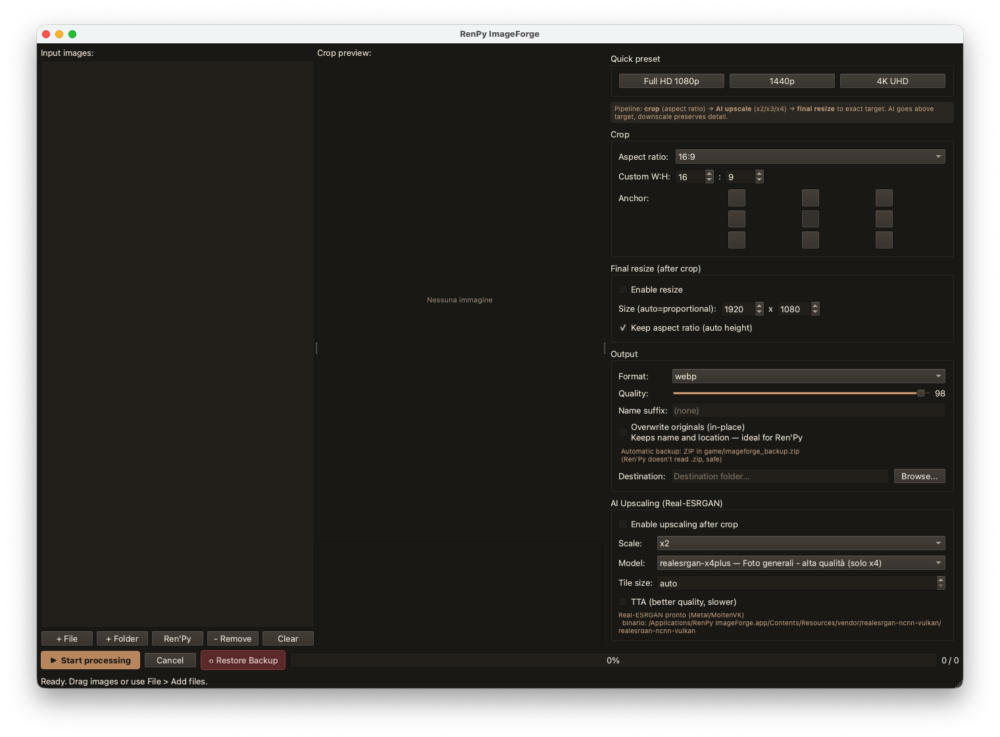

<p align="center">
  
</p>

<h1 align="center">RenPy ImageForge</h1>

<p align="center">
  A cross-platform tool for batch cropping images with fixed aspect ratio,
  resizing, AI upscaling (Real-ESRGAN ncnn/Vulkan), and Ren'Py game
  integration (archive extraction, image scanning, in-place replacement).
  Runs on macOS, Linux, and Windows.
</p>

<p align="center">
  <a href="README.it.md">Italian documentation</a> ·
  <a href="UPDATE.md">Changelog</a>
</p>

---

<p align="center">
  
</p>

---

Built for the use case: you have a bunch of images (e.g. webp 1620x1080),
crop them to a specific aspect ratio (e.g. 16:9), then upscale to full HD
(1920x1080) with an AI model.

## Requirements

- macOS (Apple Silicon or Intel), Linux, or Windows 10+
- Python 3.10+
- [uv](https://docs.astral.sh/uv/) (package manager, auto-installs dependencies)
- Real-ESRGAN ncnn bundled in `vendor/` (already included)

## Quick start

**macOS / Linux:**
```bash
cd /path/to/RenPy-ImageForge
./start.sh
```

**Windows:**
```bat
cd \path\to\RenPy-ImageForge
start.bat
```

`uv` automatically creates the venv and installs dependencies from
`pyproject.toml` on first run. No manual setup required.

## Usage

### Batch mode (default)

1. **Add images**: drag files/folders into the left list, or use
   `+ File` / `+ Folder` (or File menu).
2. **Configure crop** (right panel):
   - **Aspect ratio**: presets (16:9, 2:3, 1:1, ...) or custom W:H, or "None".
   - **Anchor**: 3x3 grid to choose where to anchor the crop
     (center, top-left, etc.).
3. **Final resize** (optional): target size in pixels. Use `auto`
   (minimum spinbox value) to keep aspect ratio on one axis.
4. **Output**: format (webp/png/jpg), quality, name suffix, destination folder.
5. **AI upscaling** (optional): enable Real-ESRGAN with scale x2/x3/x4 and
   model (anime/photo). Upscaling happens **after** crop and **before** final
   resize, so the AI works at the maximum available resolution.
6. **Start processing**: batch runs in background with progress bar and log.

### Ren'Py mode (File > Open Ren'Py game...)

To scan a Ren'Py game and find non-full-HD images among thousands of files:

1. **File > Open Ren'Py game...** (Ctrl+R)
2. **Browse** and select the `.app` or game folder
3. **Scan**: the tool extracts `.rpa` (rpatool), decompiles `.rpyc` (unrpyc)
   and analyzes `.rpy` to find images used in `scene`/`show` statements
   — excludes menus, buttons, UI
4. **Image table**: each row shows name, file, resolution and status
   (full HD / above / below / unknown)
5. **Filter**: "Only non-full-HD (below)" to see only images to upscale,
   or "Only non-full-HD (all)" for all off-target ones
6. **Select visible** and **Add to batch list**
7. Back in the main window, configure crop + upscale (1080p preset) and
   start processing

Processed images overwrite the originals in the `game/` folder: Ren'Py reads
loose files before `.rpa` archives, so no repacking is needed.

### Per-image pipeline

```
original ──crop(aspect ratio, anchor)──> cropped
        ──(optional) AI upscale xN──>  enlarged
        ──(optional) final resize──>  output (chosen format/quality)
```

If upscaling is disabled: `original ──crop + resize──> output`.

## Real-ESRGAN models

| Model | Use case | Scale |
|---|---|---|
| `realesr-animevideov3` | Anime/illustrations, fast | 2/3/4 |
| `realesrgan-x4plus` | Photorealistic/general, high quality (default) | 4 |
| `realesrgan-x4plus-anime` | Anime, high quality | 4 |

On Apple Silicon inference uses **Metal** via MoltenVK (verified on M2).
On Linux/Windows uses **Vulkan**.

## Project structure

```
RenPy-ImageForge/
├── start.sh                        # launcher (uv)
├── build.sh                        # build .app/.dmg/.zip/.tar.gz
├── pyproject.toml                  # dependencies + metadata
├── UPDATE.md                       # changelog
├── batch_cropper/
│   ├── __init__.py
│   ├── __main__.py                 # entry point (python -m batch_cropper)
│   ├── app.py                      # main GUI (PySide6)
│   ├── cropper.py                  # crop/resize logic (Pillow)
│   ├── upscaler.py                 # Real-ESRGAN ncnn wrapper
│   ├── workers.py                  # QThread batch worker
│   ├── renpy.py                    # Ren'Py integration (extraction + scan)
│   └── widgets/
│       ├── __init__.py             # CropPreviewWidget
│       ├── settings_panel.py       # settings panel
│       └── renpy_dialog.py         # Ren'Py game scan dialog
└── vendor/
    └── realesrgan-ncnn-vulkan/     # binary + models (bundled)
        ├── realesrgan-ncnn-vulkan
        └── models/
```

## Build

Create distributable packages (DMG/ZIP/TAR.GZ):

```bash
./build.sh              # full build + all packages
./build.sh --mac-only   # macOS only (DMG + ZIP)
./build.sh --source     # source distributions only
```

Output in `dist/`:
- `RenPy-ImageForge-vX.Y.Z-macOS.dmg` — macOS installer
- `RenPy-ImageForge-vX.Y.Z-macOS.zip` — macOS generic
- `RenPy-ImageForge-vX.Y.Z-Linux.tar.gz` — Linux binary
- `RenPy-ImageForge-vX.Y.Z-Windows.zip` — Windows binary
- `RenPy-ImageForge-vX.Y.Z-source.tar.gz` — source (Linux)
- `RenPy-ImageForge-vX.Y.Z-source.zip` — source (Windows)

## Ren'Py integration

The Ren'Py mode uses **UnRen Tools** from the
[`RenPy-Fan-Video`](https://github.com/...) project (sibling directory):

- `rpatool` for `.rpa` archive extraction
- `unrpyc.py` + `decompiler/` for `.rpyc` decompilation

Default path: `../RenPy-Fan-Video/UnRen Tools/UnRen Tools/`.
Override with the `UNREN_TOOLS_DIR` environment variable.

The scan analyzes decompiled `.rpy` files to find `scene`/`show` references
and resolves them to files on disk — considers **only game images**,
excluding menus, buttons and UI. For each image it reads the resolution
with PIL and classifies it against the full-HD target.

## Environment variables (advanced)

- `REALESRGAN_BIN`: path to `realesrgan-ncnn-vulkan` binary (override bundle).
- `REALESRGAN_MODELS`: path to `models/` folder (override bundle).
- `PYTHON`: Python interpreter to use in `start.sh` (default: `uv run python`).

## Troubleshooting

- **"Real-ESRGAN not found"**: verify `vendor/realesrgan-ncnn-vulkan/`
  contains the executable binary and `models/` folder. Re-download from the
  [release v0.2.0](https://github.com/xinntao/Real-ESRGAN-ncnn-vulkan/releases/tag/v0.2.0).
- **Black image after upscale**: reduce `tile size` (e.g. 128 or 256) to
  lower GPU memory usage.
- **HEIC won't open**: `pip install pillow-heif` (already in dependencies).
